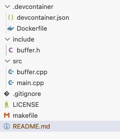

# Workshop Phase 0


## Steps

1. Create the repo in GitHub
   1. Name: hook2026
   2. Visibility: Public
   3. README.md: True
   4. License: MIT
2. Clone the Repo
3. Edit License to include your name in the (c)= ©
4. Create the file system structure with the following empty files

```
.
├── .devcontainer/
      ├── devcontainer.json
      ├── Dockerfile
├── include/
      ├── buffer.h
├── src/
      ├── buffer.cpp
      ├── main.cpp
├── makefile
├── .gitignore
├── README.md
└── LICENSE
```

The following sequence of commands executed at the command line with the repo's directory achieves this structure:
```bash
mkdir -p .devcontainer include src
touch makefile include/buffer.h src/main.cpp src/buffer.cpp 
touch .devcontainer/Dockerfile .devcontainer/devcontainer.json
```

At the end it should look like this:



5. Write the following code on `.devcontainer/devcontainer.json`:
```json
{
  "name": "UNITEC C++ Workshop",
  "build": {
    "dockerfile": "Dockerfile"
  },
  "customizations": {
    "vscode": {
      "settings": {
        "terminal.integrated.defaultProfile.linux": "bash",
        "C_Cpp.default.compilerPath": "/usr/bin/g++"
      },
      "extensions": [
        "ms-vscode.cpptools",
        "ms-vscode.cmake-tools",
        "ms-azuretools.vscode-docker"
      ]
    }
  },
  "remoteUser": "vscode",
  "postCreateCommand": "make doctor || true"
}
```
6. 


